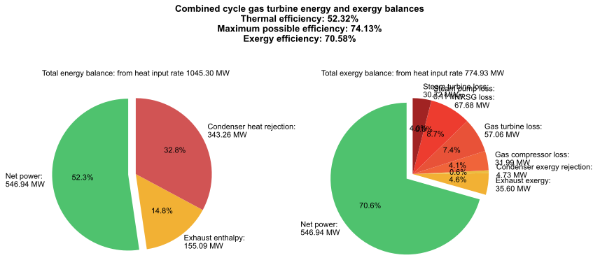
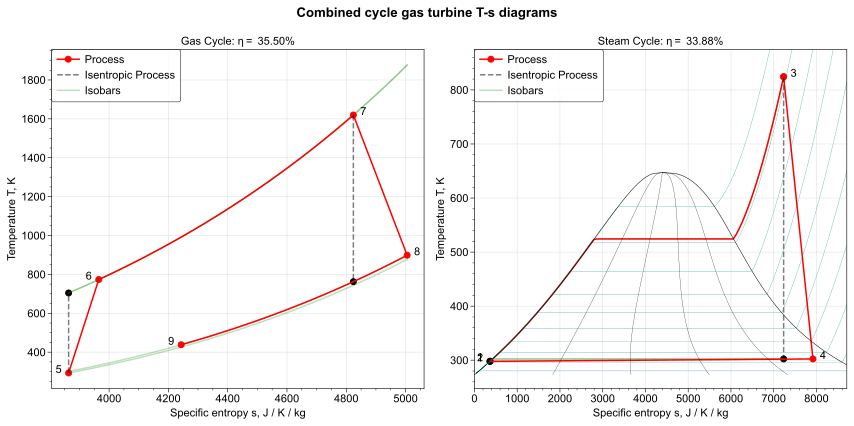

A model of a combined cycle gas turbine, with state, energy and exergy analysis.

The gas cycle side runs an air-standard Brayton cycle, with an isobaric combustor.
The steam cycle side runs a superheated Rankine cycle, with a heat recovery steam generator (HRSG) exchanging heat from the gas to the steam.
The gas outlet of the HRSG is exhausted to the atmosphere, and the heat rejected from the steam condenser is lost.

CoolProp is used to model accurate fluid properties at varying temperatures, pressures and states.

## Figures

## Features

Done:

- [x] Solve all states and properties of CCGT
- [x] Compute efficiencies and show energy and exergy balances
- [x] Show the system on a T-s diagram
- [x] Calculate from the F-factor and overall heat transfer coefficient of the HRSG

To do:

- [ ] Show the T-x diagram of the heat exchanger, compute pinch point, compute effectiveness
- [ ] Warn the user if the turbine temperatures are too high (risks blade creep), or if condenser pressure is too low (risks ice formation), or if the steam turbine wetness is too high (risks blade erosion)
- [ ] Account for fuel in the gas cycle, model the combustion accurately
- [ ] Show the energy and exergy flows as a Sankey diagram instead of a pie chart
- [ ] Allow reheat stages in the gas and/or steam cycle
- [ ] Allow recuperation from the gas exhaust
- [ ] Allow a solid oxide fuel cell (SOFC) in the gas cycle

#### Ambitious end goal

Turn it into a dashboard with interactive sliders for the inputs and outputs.

#### Possible extensions 

- calculate optimal operating parameters to maximise efficiency
- use this as a model for a control system, e.g. MPC.
